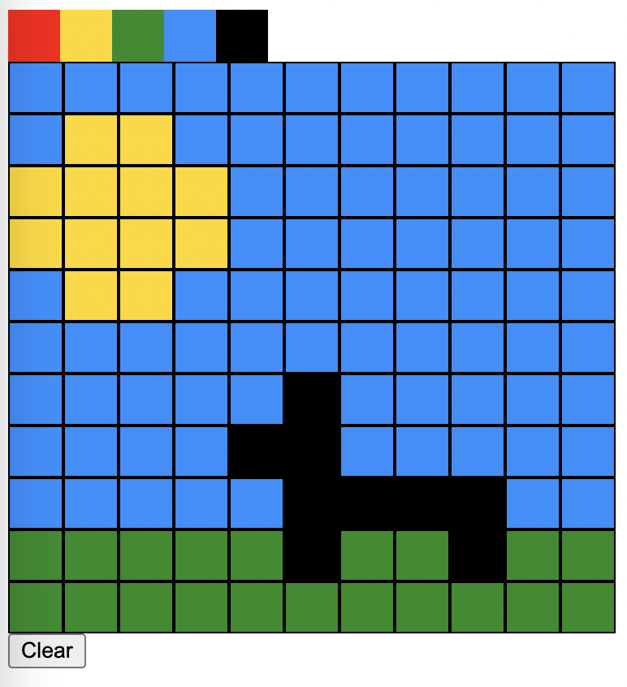

# Exercice

## Pixel Art 🎯

Le but de ce dojo est de créer une toile sur laquelle l'utilisateur peut exprimer ses talents de pixelliste. Un fichier _style.css_ est disponible et contient toutes les classes nécessaires à la réalisation. Il est seulement nécessaire d'écrire du _javascript_.

## Étape 1️

Dans le fichier script.js, écrivez le script qui va générer dans l'application (identifiée par l'id `#app`), une palette de couleurs à partir du tableau `colors`.

## Étape 2️

Ecrivez le script qui va générer un tableau html sous la palette de couleurs générée précédemment et dont le nombre de lignes et de colonnes sera déterminé par la variable `canvasSize`.

## Étape 3️

Lorsque l'utilisateur sélectionne une couleur dans la palette, il peut dessiner pixel par pixel dans le canevas.

---

## Bonus 🚀

Si vous avez des idées et des implémentation supplémentaire, n'hésitez pas à vous amuser... C'est comme ça qu'on apprend ! ❤️

---

# Author

👤 [JFM](https://github.com/jfm-wcs)

Traduit et adaptée par

👤 [Anthony](https://twitter.com/Gorski_anthony)
